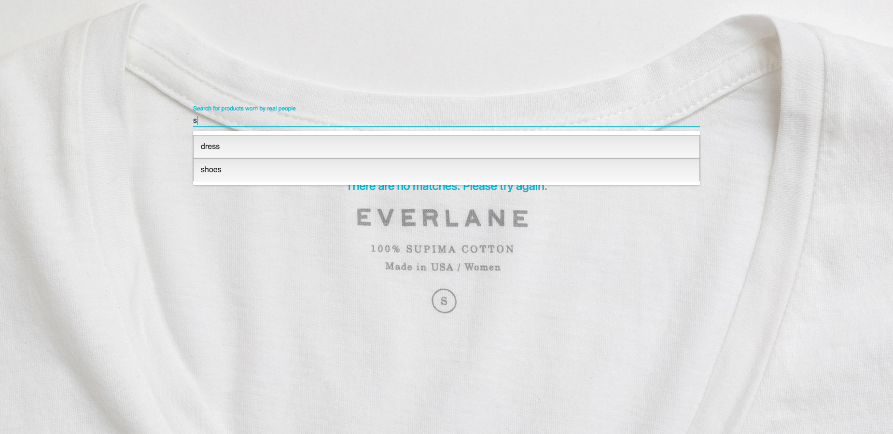

# The Real Everlane
A Twitter-integrated search for Everlane products worn by real people

###Screenshots###

###Getting Started###

	npm install

###To Start Server###

    npm start

Go to:

    http://localhost:3000

###To Run Unit Tests###

    npm test

###Notes on Process###

Please note: As of Aug 2, 2016, there is an error occuring within Material-UI but fix is not yet released. This error does not compromise functionality of this app. Error details can be found on Issue #4854: https://github.com/callemall/material-ui/issues/4854

Also, this is my first time using material-ui components and I ran into some issues testing them. I ran out of time trying to debug unit tests for material-ui components, and only have unit tests for non-material ui components. I would like to revisit and get them running in the near future. 

###Tech Stack###

    React
    React Router
    Node.js
    ES6
    Babel
    Webpack
    Webpack-dev-server
    Axios
    Mocha
    Chai
    Enzyme
    Twitter Public API
    DotEnv
    Material-UI
    Twitter
    React Tweet
    (planned) - Redux
    (planned) - Pagination
    (planned) - Deploy on Heroku